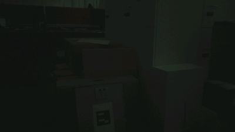

# Intel aero frontal camera ROS driver
Based on the [Intel's example](https://github.com/intel-aero/sample-apps/blob/master/hd-camera/hd-camera.cpp).
Publish the image from the frontal camera in a ROS topic.

## Build Steps

```
mkdir -p ~/Workspace/src
cd ~/Workspace/src
git clone https://github.com/LapinCodeur/intel_aero_frontal_camera_ros_driver.git
cd ~/Workspace
catkin_make
source ~/Workspace/devel/setup.bash
roslaunch intel_aero_frontal_camera_ros_driver frontal_camera.launch
```

## Result

```
rosrun image_view image_view image:=/front_cam
```
You will see the image from the frontal camera, the image has a poor contrast and light.


I have tried to improve it, but I wasn't successfull.
I have made some parameters that you can change in the launch file in order to improve the brightness.
Set correction_brightness to true if you want a correction.
Try different gamma, doesn't go over 1.
```
<param name="correction_brightness" value="false"/>
<param name="gamma" value="0.4"/>
```


## To do

- Improve the brightness by setting properly the driver. The camera is not fully compatible with V4L2...
